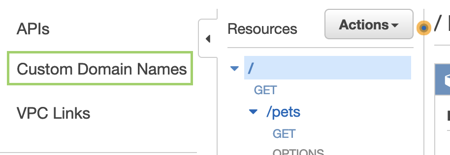
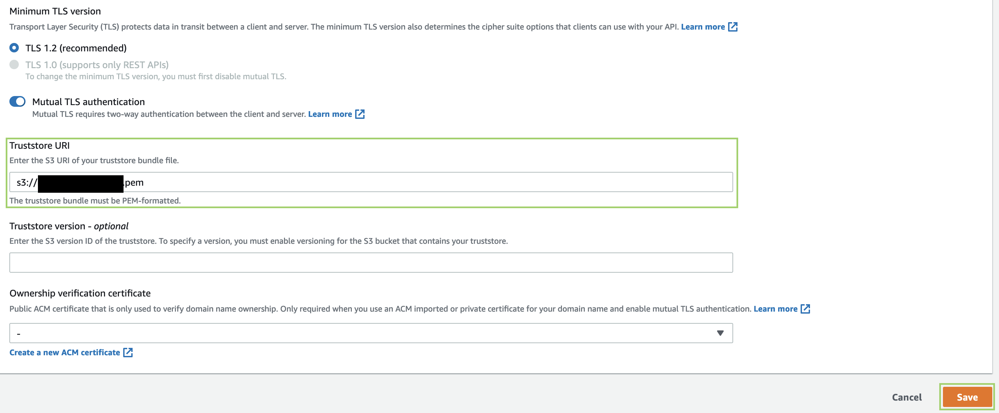
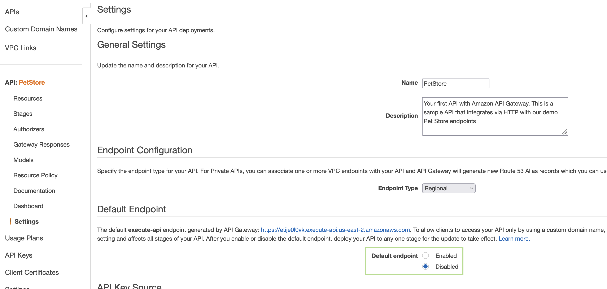

# Configuring a Node.js Application using mTLS with Cloudentity Amazon API Gateway Authorizer & AWS API Gateway

In a [previous article](link to previous article), we created a Node.js application to use Mutual-TLS and certificate bound access tokens with [Cloudentity Authorization Platform](https://authz.cloudentity.io/). In this tutorial, we will configure the application to use the [Cloudentity Amazon API Gateway Authorizer](https://docs.authorization.cloudentity.com/guides/developer/protect/aws_api_gw/aws/?q=aws%20api) to enforce an API access policy. 

The authorization server will issue certificate bound access tokens to the Node.js client application and the client application will then access a protected resource via AWS API Gateway. AWS API Gateway will use Cloudentity AWS API Gateway authorizer to enforce the certificate hash in the JWT matches the hash of the certificate taken from its TLS layer as per a policy which we will create. 

### Prerequisites

##### Cloudentity SaaS
Cloudentity offers a free SaaS Tenant and you can sign up for one, if you have not already, for a free account. With this you are basically getting a free OAuth/OIDC compliant server with all the latest specifications comprising of OpenData initiatives across the world.

##### Go Application
- [Node.js](https://nodejs.org) - Recommended v16.x +
- [AWS Account with priviledges to Create Lambda functions and AWS API Gateway](https://aws.amazon.com/)

### Basic Concepts
OAuth 2.0 Mutual-TLS client authentication and certificate bound access tokens is explained in [RFC 8705](https://datatracker.ietf.org/doc/html/rfc8705). When following a traditional OAuth 2.0 authorization code flow, the access token is all that is required to access a protected resource. However, anyone with access to this token can then access the resource even if the token should not be in their possession. Mutual-TLS client authentication allows us to bind access tokens to a client’s x.509 certificate and this allows the resource server to verify that the presenter of this access token was issued this token.  

Once the client receives a certificate bound access token it will send the token in the authorization header when calling the resource server API. The token includes the `cnf` claim which has the `x5t#S256` confirmation method member.  The value of this member is the base64url-encoded SHA-256 hash, or thumbprint of the DER encoding of the x.509 certificate. Since we are using AWS API Gateway for our protected resource API, AWS API Gateway will terminate the TLS connection and then inject the X.509 certificate into the Cloudentity lambda authorizer. The authorizer will then enforce our policy by taking the hash of the certificate and comparing it to the `cnf` claim in the token. If they match then access to the protected resource is authorized, otherwise the request is not authorized.

### Preparing Cloudentity SaaS
Let's create a new applicatin in [Cloudentity Authorization Platform](https://authz.cloudentity.io/) and prepare it to use mTLS. We also will add an AWS API Gateway authorizer. Then we will create a policy to enforce that the requestor for access to the protected resource is in possesion of the certificate to which the access token is bound. 
Log in to [Cloudentity Authorization Platform](https://authz.cloudentity.io/) and select a workspace. We are using the `Default` workspace in this tutorial. 

Create a new client application. Select Applications->Clients and choose 'Create Application'.


Give the application a name. Choose your application type. We chose 'Server Web' for our application. Next click 'Create'. 


After creating the application you will be redirected to your new application. Choose the 'OAuth' tab. Scroll down to 'Token Endpoint Authentication Method' and choose `TLS Client Authentication`. Further down under 'Certificate Metadata' choose `TLS_CLIENT_AUTH_SAN_DNS`. In 'DNS Name SAN entry' enter `acp` if your are using the provided certfiicate. Otherwise, enter the contents of your certificate. Check 'Certificate bound access tokens' and then choose 'Save'. On the right copy your CLIENT ID, CLIENT SECRET, and the TOKEN URL. You will enter these in the `.env` at the root of the Node.js application project folder.


On the left hand menu go to Auth Settings->OAuth and paste in your root CA certificate contents. In the repository, it is the `ca.pem` contents. Check `TLS Client Authentication`. Click 'Save Changes'.

Now we need to create the Cloudentity Amazon API Gateway authorizer. On the left sidebar choose Enforcement->Authorizers and then click 'Create Gateway'.


On the 'Authorizers' page choose 'Amazon API Gateway'. Give the gateway a name, check 'Create and bind services automatically' and choose 'Save'.


After creating the authorize you will be redirected to the quickstart guide. Click 'Download Authorizer'. You will upload this to AWS Lambda in a future step.


Click on the 'Settings' tab. Scroll down and copy the Client ID, Client Secret, and Issuer URL. You will enter these values as environment variables in your AWS Lamdba function.

Your workspace, application, and authorizer are now ready.

### Preparing AWS API Gateway

## Create an API using AWS API Gateway
Log in to your [AWS acount](https://aws.amazon.com/) and go to AWS API Gateway. Choose 'Create API'. 


Click 'Build' on the 'REST API' api type. 


The protocol should be REST and for this tutorial we chose 'Example API'. Ensure endpoint type is 'Regional' and click 'Create API'. 


Choose 'Actions' and then 'Deploy API'. Choose a stage or create a new one. For this tutorial we called the new stage 'dev'.


 The next step requires a custom domain. On the left side choose 'Custom Domain Names'. 
 
 
 Select your domain or [create a new one](https://docs.aws.amazon.com/apigateway/latest/developerguide/how-to-custom-domains.html) if necessary. Once you have selected your custom domain, under 'Domain Details' choose 'Edit'. 
 
 
 Select 'Mutual TLS authentication' and enter your trust store URI. If you have a link Your trust store URI use that. Otherwise you can upload the ca.pem that you are using to S3 and then use the URI for the ca.pem uploaded to S3. Click 'Save'. Once you save you will see the Domain Details pane and 'Mutual TLS' will eventually turn green showing that mTLS is now active.
 
 
 Inside 'Configuration' choose 'Edit' under 'Endpoint Configuration'. 
 
 
 Select your ACM certificate and save. Click the 'API Mappings' tab choose 'Configure API Mappings' and select the API and stage that you created in AWS API Gateway then save.
 
 
 Go back to your API and on the left menu choose 'Settings'. Under 'Default Endpoint' choose 'Disabled'. This ensures that only your custom domain is called instead of the default URL that was created automatically when you created the API.
  
  
 ## Create a AWS Lambda Function
 Go to the search for services search field and search for lambda and select the Lambda service. 
 

 Choose 'Create function' from the AWS Lambda home page. 
 
 
 Give the function any name you wish and choose 'Go 1.x' from the 'Runtime' dropdown menu. Click 'Create function'.
 

 On the 'Code' tab choose 'Upload from' and select the authorizer zip you downloaded earlier when creating the Amazon AWS Authorizer. 
 
  
  
 Under 'Runtime settings' change the handler name to `cloudentity-mp-aws-gw-authorizer`. 
 
 
 
 Go to the configuration tab. Optionally, set the memory size to a desired size under 'General Configuration' if desired. We choose 128MB. 
 
 
 Chooose 'Environment Variables' and select 'Edit'.
 
 
 Add the following using the values copied when setting up Cloudentity Authorization Platform.
 - ACP_CLIENT_ID
 - ACP_CLIENT_SECRET
 - ACP_ISSUER_URL
 - ACP_TENANT_ID


Go to 'Triggers' and click 'Add trigger'. 


Select the 'EventBridge' trigger and set a rule to schedule expression for `rate(1 minute)`. 


At the top of the AWS application copy the ARN. 


Go to 'Permissions' under the configuration tab. Click the role name under 'Execution Role'. 


Click 'Add Permissions' then choose 'Create inline policy'. 


Click 'Choose service' and add API Gateway. Under actions choose 'All API Gateway Actions'. Select 'Resources' and choose 'All resources'. We are adding all resources for simplicity in this tutorial. Adjust these according to your needs. 


Click 'Add additional permissions' and select 'Lambda'. Under 'Manual actions' choose 'All Lmabda actions'. Under 'Resources' choose 'All resources'. 


Click 'Review policy', give the policy a name and then click 'Create policy'.


Finally, go back to API Gateway and redeploy the API. On the left menu select 'Authorizers' and verify that `cloudentity-acp-authorizer` is present.


Your AWS API Gateway is now using Mutual-TLS and the Cloudentity Amazon API Gateway authorizer to protect your API. 

### Running the Node.js Application
In At the root of the project go to the `.env` file and enter the following:
- MTLS_OAUTH_CLIENT_ID
- MTLS_OAUTH_CLIENT_SECRET
- MTLS_OAUTH_TOKEN_URL
- MTLS_RESOURCE_URL 

Your `MTLS_RESOURCE_URL` is the url of the resource we created in AWS API Gateway. It will be your custom domain plus the API path. For example, if you created the example API and your custom domain is `api.example.com` then your MTLS_RESOURCE_URL would be `https://api.example.com/pets`.

Now run the application from terminal at the root of the project with 
```
npm start
```

Now go to `http://localhost:5002/home` and get an access token by clicking 'Get Certificate Bound Access Token'.  Notice the `cnf` claim with the x5t#S256 member. This is the certificate thumbprint. Now click 'Call Resource server with Certificate Bound Access Token' and verify that you receive a JSON response. In the case of the `/pets/` API it will be a JSON response of pets. 

Currently, a policy is not set on the API in Cloudentity Authorization Platform. Go back to your tenant in [Cloudentity Authorization Platform](https://authz.cloudentity.io/) and go to Enforcement-APIs. Since we chose 'Create and bind services automatically', once the authorizer was start and the API deployed in AWS our APIs appear here automatically. 


Select the API you wish to protect with a policy. For the example API we choose `GET /pets`. Notice the API shows 'Unrestricted'. Click 'Unrestricted' and choose 'Add new policy'. Give the policy a name and choose 'Cloudentity' for the policy language. Click 'Create'. 


Save the following policy to a file.
```
validators:
  - name: attributes
    conf:
      fields:
        - comparator: equals
          field: 'request.mtls.x5t#S256'
          value: '$authnCtx.cnf.x5t#S256'
    recovery: null
```

Click on the trash can to delete the existing 'Fail' policy. Now in the policy editor click the 3 dots in the top right of the editor and select 'Upload'.  


Upload the policy you just saved to a file. After uploading click 'Save'.


The policy enforces the request context includes the certificate thumbprint of the X.509 certificate that was injected by AWS API Gateway into our authorizer. It verifies that this thumbprint is equal to the certficate thumbprint that is inluded in the access token, that is the certificate bound to the access token is equal to the certificate that was used during the mTLS handshake. If they are equal then the authorizer allows access to the resource. If they are not equal then the authorizer will reject access to the resource.

Once you save the policy press the back arrow and save the policy on the API you wish to protect. You should see your API is now protected with your new policy.


Now in your browser go back to `http://localhost:5002/home` and verify that you can still access the protected resource after obtaining an access token.

You can also look in CloudWatch logs to see the status of a request. In your lambda function go to 'Monitor' and then click 'View logs in CloudWatch'. You will see the logs for this lamdba function. Make a request and notice that the logs will show that the policy was checked during the request and that the request was authorized or denied. For example, the following shows the resource requested was `/pets`. The policy name is shown, here it is `mtls-aws-api-gateway-mtls-policy` as that is the name we gave the policy. We see the status is `AUTHORIZED`.
```
{
…
    "msg": "request validated",
    "path": "/pets",
    "rule": {
        "method": "GET",
        "path": "/pets",
        "policyName": "mtls-aws-api-gateway-mtls-policy",
        "API": {
            "api_type": "rest",
            "can_have_policy": true,
            "method": "GET",
            "path": "/pets",
            "policy_id": "mtls-aws-api-gateway-mtls-policy", 
        }
    },
    "stage": "dev",
    "status": "AUTHORIZED",
}
```

### Conclusion
[Cloudentity Authorization Platform](https://authz.cloudentity.io/) fully supports Mutual-TLS authentication and certificate bound access tokens. Using the Cloudentity Amazon API Gateway authorizer, we were able to specify a policy that enforces that the access token is bound with the certificate used during the TLS handlshake. We created an authorizer and uploaded it to AWS Lambda. We also configured AWS API Gateway to use the Cloudentity authorizer. 

### Relevant Links
 - [RFC 6749](https://datatracker.ietf.org/doc/html/rfc6749)
 - [RFC 8705](https://datatracker.ietf.org/doc/html/rfc8705)
 - [Mutual-TLS with AWS API Gateway](https://aws.amazon.com/blogs/compute/introducing-mutual-tls-authentication-for-amazon-api-gateway/)
 - [Custom Domains with AWS API Gateway](https://docs.aws.amazon.com/apigateway/latest/developerguide/how-to-custom-domains.html)

